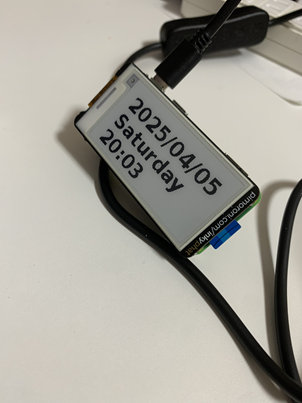

# Digital Watch with Raspberry Pi + Inky PHAT

デジタル時計プロジェクト - Raspberry Pi と Inky PHAT e-paper ディスプレイを使用したスタイリッシュなデジタル時計



## 概要

このプロジェクトは、Raspberry Pi と Pimoroni Inky PHAT e-paper ディスプレイを使用して、電力効率的でスタイリッシュなデジタル時計を作成します。e-paperディスプレイの特性により、低消費電力で常時表示が可能で、見やすい時計として機能します。

### 主な機能

- **日時表示**: 年月日、曜日、時分を表示
- **自動更新**: 1分ごとに時刻を自動更新
- **低消費電力**: e-paperディスプレイによる省電力設計
- **自動起動**: システム起動時の自動開始（systemdサービス）
- **回転対応**: 180度回転表示に対応

## ハードウェア要件

### 必須コンポーネント
- **Raspberry Pi Zero 2 W** (推奨) または他のRaspberry Piモデル
- **Pimoroni Inky PHAT** e-paper ディスプレイ
- microSDカード (8GB以上推奨)
- 電源アダプター (5V 2.5A推奨)

### 接続方法
Inky PHATをRaspberry PiのGPIOヘッダーに直接接続してください。追加の配線は不要です。

## ソフトウェア要件

### OS
- Raspberry Pi OS (Bullseye以降推奨)
- Python 3.7以降

### 必要なPythonパッケージ
- `inky` - Inky PHAT制御ライブラリ
- `Pillow` - 画像処理ライブラリ

## インストール手順

### 1. 前提条件の確認
```bash
# Pythonバージョンの確認
python3 --version

# pipの確認・アップデート
sudo apt update
sudo apt install python3-pip
```

### 2. プロジェクトのクローン
```bash
git clone https://github.com/Moge800/digitalwatch.git
cd digitalwatch
```

### 3. 依存関係のインストール
```bash
# 必要なシステムパッケージをインストール
sudo apt install python3-venv

# 仮想環境の作成（推奨）
python3 -m venv .venv
source .venv/bin/activate

# Pythonパッケージのインストール
pip install inky pillow
```

### 4. 手動テスト実行
```bash
# Hello Worldテストの実行
python3 hello_world.py

# メインプログラムのテスト実行
python3 main.py
```

### 5. システムサービスとして登録
```bash
# サービスの登録と開始
sudo bash register_service.sh

# システム再起動
sudo reboot
```

## 使用方法

### 手動実行
```bash
cd digitalwatch
source .venv/bin/activate
python3 main.py
```

### サービス制御
```bash
# サービス状態の確認
sudo systemctl status digitalwatch.service

# サービスの開始
sudo systemctl start digitalwatch.service

# サービスの停止
sudo systemctl stop digitalwatch.service

# サービスの再起動
sudo systemctl restart digitalwatch.service

# ログの確認
sudo journalctl -u digitalwatch.service -f
```

### プログラムの停止
手動実行時は `Ctrl+C` で停止できます。

## 設定のカスタマイズ

`main.py`ファイル内の定数を変更することで、表示をカスタマイズできます：

```python
FONT_PATH = "/usr/share/fonts/truetype/dejavu/DejaVuSans-Bold.ttf"  # フォントパス
FONT_SIZE = 35                # フォントサイズ
UPDATE_INTERVAL = 1           # 更新チェック間隔（秒）
ROTATION_DEGREE = 180         # 画面回転角度（0, 90, 180, 270）
```

## トラブルシューティング

### よくある問題と解決方法

#### 1. ディスプレイが表示されない
- **原因**: Inky PHATが正しく接続されていない
- **解決策**: GPIO接続を確認し、Raspberry Piを再起動

#### 2. インポートエラー
```bash
# エラー例: ModuleNotFoundError: No module named 'inky'
pip install inky pillow
```

#### 3. 権限エラー
```bash
# GPIO アクセス権限の確認
sudo usermod -a -G gpio $USER
# ログアウト・ログインが必要
```

#### 4. フォントが表示されない
- **原因**: 指定したフォントファイルが存在しない
- **解決策**: デフォルトフォントが自動的に使用されます

#### 5. サービスが起動しない
```bash
# サービス状態とログの確認
sudo systemctl status digitalwatch.service
sudo journalctl -u digitalwatch.service --since "10 minutes ago"
```

### ログの確認方法
```bash
# リアルタイムログ監視
sudo journalctl -u digitalwatch.service -f

# 過去5分間のログ
sudo journalctl -u digitalwatch.service --since "5 minutes ago"
```

## ファイル構成

```
digitalwatch/
├── main.py                 # メインプログラム
├── hello_world.py          # テスト用プログラム
├── launch.sh              # 起動スクリプト
├── register_service.sh    # サービス登録スクリプト
├── README.md              # このファイル
├── license.txt            # ライセンス情報
└── image/
    └── pict.png           # プロジェクト画像
```

## 開発情報

### 開発環境のセットアップ
```bash
# 開発用仮想環境の作成
python3 -m venv .venv
source .venv/bin/activate
pip install inky pillow

# コードの編集
# VS Codeワークスペースファイル: digitalwatch.code-workspace
```

### コードの構造
- `get_formatted_time()`: 時刻フォーマット処理
- `load_font()`: フォント読み込み
- `update_display()`: ディスプレイ更新
- `calculate_sleep_time()`: 次の分境界までの待機時間計算
- `main()`: メインループ

## ライセンス

このプロジェクトはApache License 2.0の下でライセンスされています。詳細は [license.txt](license.txt) をご覧ください。

## 貢献

バグ報告や機能追加の提案は、GitHubのIssueまたはPull Requestでお願いします。

## 作者

- **Moge800** - プロジェクト作成者

---

**注意**: このプロジェクトはRaspberry Pi専用です。他のプラットフォームでの動作は保証されません。